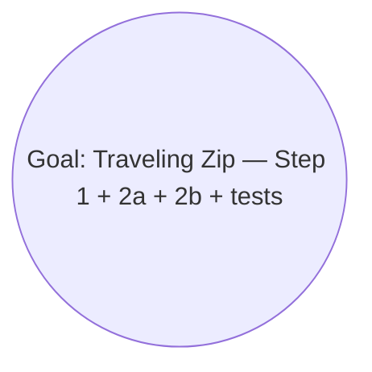

# Mikado Goal: Implement The Traveling Zip plan (Step 1 + Step 2a + Step 2b + tests)

**Slug:** traveling-zip
**Started:** 2026-04-25
**Plan:** /Users/adanelz/.claude/plans/rustling-knitting-squid.md
**Build:** `cd backend && go build ./...`
**Test:** `make test`
**Commit strategy:** unset
**Base commit:** d3d128caa73ff02ee65d5e91eb964d05de464dc8

## Status
Discovering prerequisites.

## Mikado Graph

## Prerequisites

_(none yet; will populate after the naive experiment)_

## Notes and learnings

- Backend is Go 1.26, single package `backend/core` with scaffolded `ZipScheduler` (LaunchFlights returns empty). `Runner.Simulate` already wires queue + launch loop minute-by-minute.
- Snapshot pipeline (`BuildSimulationSnapshot`) is in place and consumed by `cmd/api` and the React frontend; only the scheduler internals are missing.
- Frontend is Vite + React with a Vitest framework already set up (commit 7f6e5d1).
- CI runs Go tests on PRs (`.github/workflows/ci.yml`).
- Constants (NumZips=10, MaxPackages=3, Speed=30 m/s, Range=160 km) live alongside `SimulationConfig` in `core/simulation.go`.
