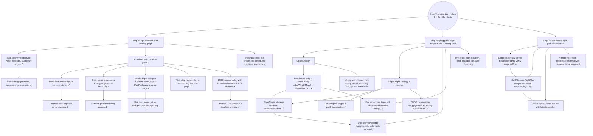

# Mikado Goal: Implement The Traveling Zip plan (Step 1 + Step 2a + Step 2b + tests)

**Slug:** traveling-zip
**Started:** 2026-04-25
**Plan:** /Users/adanelz/.claude/plans/rustling-knitting-squid.md
**Build:** `make build`
> frontend: build-frontend
> backend: build-backend
**Test:** `make test`
> frontend: test-frontend
> backend: test-backend
**Commit strategy:** folded
**Base commit:** d3d128caa73ff02ee65d5e91eb964d05de464dc8

## Status

Prerequisites recorded from naive experiment; ready to start leaf loop.

## Mikado Graph

## Prerequisites

### Step 1 — Foundation

- [x] **G1**: Introduce `Graph` type (Nest + hospital nodes; symmetric Euclidean edges) in a new file under `backend/core/`. Goal is a real type, not just a distance map.
- [x] **T1G**: Unit tests for graph (node set = Nest + 21 hospitals, edge weights match Euclidean, symmetric edges).

### Step 1 — Scheduler

- [x] **P1**: Track fleet availability — `zipReturnTimes` slice; `availableZips(currentTime)` reclaims returned zips. Naive proved this is required to avoid over-launching.
- [x] **P2**: Sort/partition pending orders so Emergency is considered before Resupply.
- [x] **P3**: Flight builder that (a) collapses duplicate hospitals into one stop with N packages, (b) caps stops by MaxPackagesPerZip total packages, (c) rejects routes exceeding `zipMaxCumulativeRangeM`.
- [x] **P4**: Multi-stop route ordering using nearest-neighbor traversal over the graph (improvement on FIFO).
- [x] **P5**: 20/80 fleet reserve — cap concurrent Resupply launches at 80% of fleet, but allow borrowing the reserve when a Resupply order risks missing its EoD deadline. EoD risk threshold: round-trip direct flight time > seconds remaining in day. Default policy is `ReserveSoft`. Also wires `LaunchFlights` end-to-end.
- [x] **T1S1**: Unit test for fleet capacity (availableZips reclaim, LaunchFlights respects fleet size).
- [x] **T1S2**: Unit test for priority ordering (pendingByPriority + LaunchFlights launches Emergency before earlier Resupply).
- [x] **T1S3**: Unit tests for buildFlight rules — range gating (Far rejected, Near+Mid kept), duplicate-stop collapse (3 orders, 1 stop), MaxPackages cap (third order deferred).
- [x] **T1S4**: Reserve policy unit tests — Hard blocks Resupply at the reserve boundary, None ignores it, Soft blocks early in the day but borrows the reserve when EoD round-trip exceeds remaining time. Plus a direct test of resupplyAtRisk thresholding.
- [x] **T1I**: Integration test running full `orders.csv` through the simulator; asserts 0 unfulfilled, no flight exceeds range, never more than `numZips` concurrent flights, Emergency mean delay < Resupply mean delay.

### Step 2a — Configurable routing

- [x] **C1a**: Extend `SimulationConfig` (and `ParseConfig`) with optional fields. Adds `EdgeWeightModel` (default `"euclidean"`, consumed by C3) and `EmergencyWaitThresholdSec` (default 0, consumed by C4). `ParseConfig` accepts both as optional with defaults; existing payloads continue to work unchanged.
- [ ] **C1b**: UI migration — replace the large title block with a thin pinned header nav; move config editing into a modal; "Edit config" and "Run simulator" become header buttons; add a single summary section at the top with totals from each data section; refactor the existing data tables into one generic `DataTable` component (extracted from current code) with a fixed-height option. Keep as one leaf; sub-prereqs may surface during a worktree experiment.
- [x] **C2a**: `EdgeWeight` strategy interface; default impl returns Euclidean (extracted from G1). `Graph.EdgeWeight` now delegates to a pluggable strategy; `NewGraph` keeps the default Euclidean behavior, and `NewGraphWithEdgeWeight` lets callers inject alternatives (used by C3).
- [x] **C2b**: Pre-compute edges at graph construction so `EdgeWeight` is an O(1) map lookup rather than a `sqrt` per call. The Euclidean strategy now builds an `edges[from][to]` matrix once.
- [x] **C2c**: Add a TODO comment on `resupplyAtRisk` documenting that `2 * EdgeWeight(Nest, X)` overestimates the actual round-trip time when the order flies as part of a multi-stop, so the at-risk threshold triggers reserve borrowing slightly earlier than strictly necessary — a conservative fail-safe. Code change deferred to post-Step-2.
- [ ] **C3**: One alternative edge-weight model (e.g. range-penalty: edges proportionally penalize legs near max range to prefer compact loops).
- [x] **C4**: `EmergencyWaitThresholdSec` is now read by `NewZipScheduler` and added as a second OR-trigger inside `resupplyAtRisk`. When set > 0, a Resupply order that has been queued for at least the threshold seconds is treated as at-risk and may borrow the reserve under `ReserveSoft`. T2A will pin the observable behavior change.
- [ ] **T2A**: Tests proving each strategy and knob changes outputs observably.

### Step 2b — Visualization

- [ ] **V1**: Confirm `Snapshot` already has hospitals + flights in a shape the frontend can map (Hospital{name, north, east} + Flight{hospitalNames, orderIds, launchTime}).
- [ ] **V2**: `FlightMap` React component — SVG of Nest + hospitals scaled to viewbox, flight legs drawn as polylines.
- [ ] **V3**: Mount `FlightMap` in `App.jsx` showing the most recent simulation snapshot.
- [ ] **T2B**: Vitest smoke test — `FlightMap` renders given a representative snapshot fixture.

## Notes and learnings

- Backend is Go 1.26, single package `backend/core` with scaffolded `ZipScheduler`. `Runner.Simulate` already wires queue + per-minute launch.
- Snapshot pipeline (`BuildSimulationSnapshot`) is in place and consumed by `cmd/api` and the React frontend; only the scheduler internals + frontend visualization are missing.
- Frontend has Vitest set up (commit 7f6e5d1).
- CI runs Go tests on PRs (`.github/workflows/ci.yml`).
- Constants (NumZips=10, MaxPackages=3, Speed=30 m/s, Range=160 km) live alongside `SimulationConfig` in `core/simulation.go`.
- **Naive observation**: pure FIFO greedy fulfills 300 orders but emergencies launch dozens of minutes after queueing. Priority + reserve are real requirements, not nice-to-haves.
- **Naive observation**: multi-order-same-hospital trips emit duplicate consecutive stops; flight builder must dedupe stops while still tracking N packages per stop.
- **Naive observation**: time conversion is `dist / speedMps` (m / (m/s) = s) — int truncation is fine for second-resolution simulation but worth noting in the scheduler comment.
- All interaction with code goes through `make` targets (per user direction); no direct `go build`/`go test` calls.
- **P4 experiment**: across all 1330 three-stop combinations of the 21 hospitals, NN gives avg route 188km vs FIFO 203km (and optimal 185km). NN matches optimal in 57% of combos and shrinks the over-160km set from 1021 to 944. NN sits inside `buildFlight`'s range gate so flights that fit only when reordered are not rejected.
- **P5 experiment**: against `orders.csv` with 10 zips, `ReserveHard` cuts emergency mean delay from 531s (no reserve) to 254s — a 52% win — at the cost of resupply mean delay rising from 2399s to 3056s. `ReserveSoft` is identical to Hard at 10 zips because the dataset's last order is at 19:56 and direct flight times don't outrun the seconds-remaining threshold until very late. Stress-tested at 4 zips: SOFT recovers 3 of the 7 extra unfulfilled orders that HARD leaves behind by letting at-risk Resupply borrow the reserve. Threshold tuning (a stale-resupply timeout) is a natural fit for the C4 configurable knob in Step 2a.
