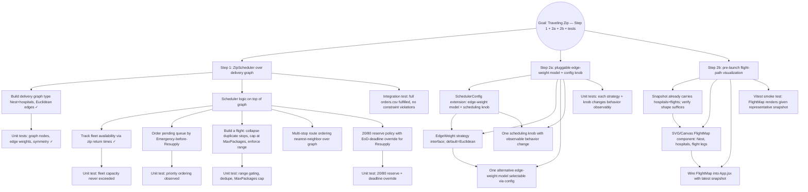

# Mikado Goal: Implement The Traveling Zip plan (Step 1 + Step 2a + Step 2b + tests)

**Slug:** traveling-zip
**Started:** 2026-04-25
**Plan:** /Users/adanelz/.claude/plans/rustling-knitting-squid.md
**Build:** `make build`
> frontend: build-frontend
> backend: build-backend
**Test:** `make test`
> frontend: test-frontend
> backend: test-backend
**Commit strategy:** folded
**Base commit:** d3d128caa73ff02ee65d5e91eb964d05de464dc8

## Status

Prerequisites recorded from naive experiment; ready to start leaf loop.

## Mikado Graph

## Prerequisites

### Step 1 — Foundation

- [x] **G1**: Introduce `Graph` type (Nest + hospital nodes; symmetric Euclidean edges) in a new file under `backend/core/`. Goal is a real type, not just a distance map.
- [x] **T1G**: Unit tests for graph (node set = Nest + 21 hospitals, edge weights match Euclidean, symmetric edges).

### Step 1 — Scheduler

- [x] **P1**: Track fleet availability — `zipReturnTimes` slice; `availableZips(currentTime)` reclaims returned zips. Naive proved this is required to avoid over-launching.
- [ ] **P2**: Sort/partition pending orders so Emergency is considered before Resupply.
- [ ] **P3**: Flight builder that (a) collapses duplicate hospitals into one stop with N packages, (b) caps stops by MaxPackagesPerZip total packages, (c) rejects routes exceeding `zipMaxCumulativeRangeM`.
- [ ] **P4**: Multi-stop route ordering using nearest-neighbor traversal over the graph (improvement on FIFO).
- [ ] **P5**: 20/80 fleet reserve — cap concurrent Resupply launches at 80% of fleet, but allow borrowing the reserve when a Resupply order risks missing its EoD deadline. Define "EoD risk" precisely (e.g., distance/speed time-to-deliver > seconds-remaining-in-day).
- [ ] **T1S1..T1S4**: Targeted unit tests per behavior above.
- [ ] **T1I**: Integration test running full `orders.csv` through the simulator; asserts 0 unfulfilled, no flight exceeds range, never more than `numZips` concurrent flights, Emergency mean delay < Resupply mean delay.

### Step 2a — Configurable routing

- [ ] **C1**: Extend `SimulationConfig` (and `ParseConfig`) with optional fields for `edgeWeightModel` and one scheduling knob (e.g. `emergencyWaitThresholdSec`).
- [ ] **C2**: `EdgeWeight` strategy interface; default impl returns Euclidean (extracted from G1).
- [ ] **C3**: One alternative edge-weight model (e.g. range-penalty: edges proportionally penalize legs near max range to prefer compact loops).
- [ ] **C4**: One scheduling knob that changes observable behavior (e.g. `emergencyWaitThresholdSec` triggering reserve-borrow earlier).
- [ ] **T2A**: Tests proving each strategy and knob changes outputs observably.

### Step 2b — Visualization

- [ ] **V1**: Confirm `Snapshot` already has hospitals + flights in a shape the frontend can map (Hospital{name, north, east} + Flight{hospitalNames, orderIds, launchTime}).
- [ ] **V2**: `FlightMap` React component — SVG of Nest + hospitals scaled to viewbox, flight legs drawn as polylines.
- [ ] **V3**: Mount `FlightMap` in `App.jsx` showing the most recent simulation snapshot.
- [ ] **T2B**: Vitest smoke test — `FlightMap` renders given a representative snapshot fixture.

## Notes and learnings

- Backend is Go 1.26, single package `backend/core` with scaffolded `ZipScheduler`. `Runner.Simulate` already wires queue + per-minute launch.
- Snapshot pipeline (`BuildSimulationSnapshot`) is in place and consumed by `cmd/api` and the React frontend; only the scheduler internals + frontend visualization are missing.
- Frontend has Vitest set up (commit 7f6e5d1).
- CI runs Go tests on PRs (`.github/workflows/ci.yml`).
- Constants (NumZips=10, MaxPackages=3, Speed=30 m/s, Range=160 km) live alongside `SimulationConfig` in `core/simulation.go`.
- **Naive observation**: pure FIFO greedy fulfills 300 orders but emergencies launch dozens of minutes after queueing. Priority + reserve are real requirements, not nice-to-haves.
- **Naive observation**: multi-order-same-hospital trips emit duplicate consecutive stops; flight builder must dedupe stops while still tracking N packages per stop.
- **Naive observation**: time conversion is `dist / speedMps` (m / (m/s) = s) — int truncation is fine for second-resolution simulation but worth noting in the scheduler comment.
- All interaction with code goes through `make` targets (per user direction); no direct `go build`/`go test` calls.
